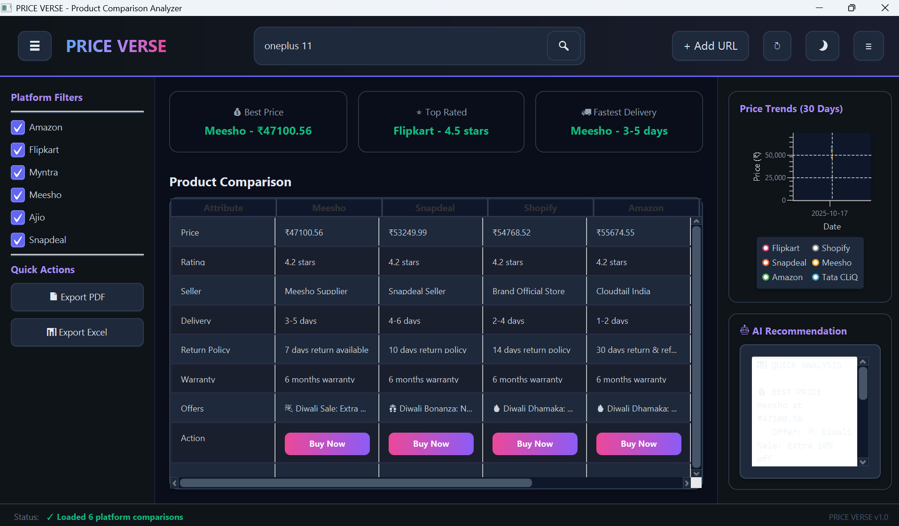
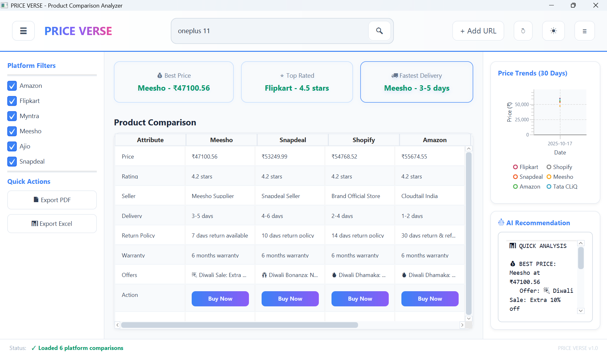
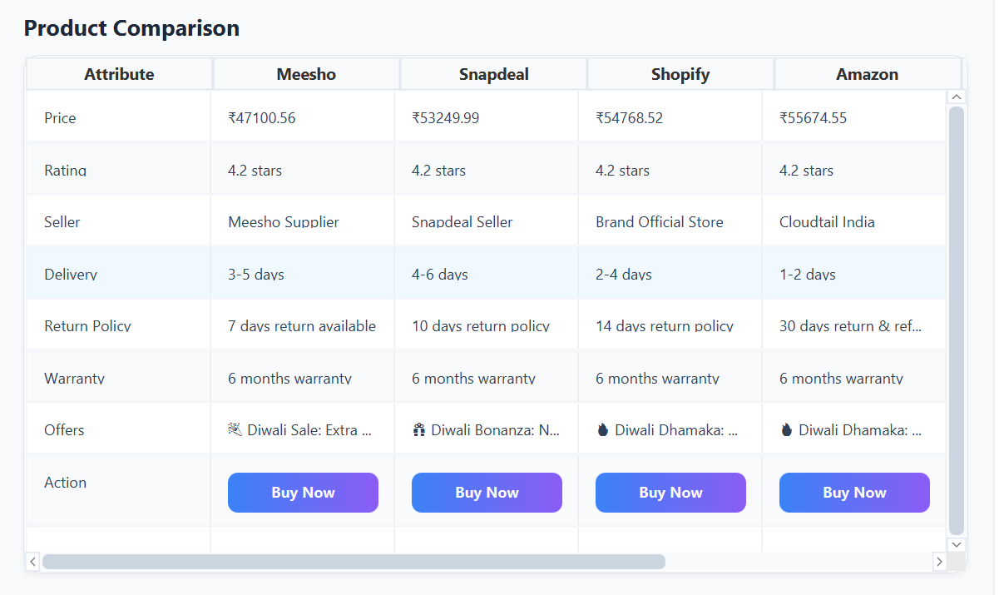

# 🛒 PRICE VERSE - E-Commerce Product Comparison Analyzer

A powerful JavaFX desktop application that compares product prices, ratings, and offers across multiple Indian e-commerce platforms using AI-powered web scraping.

## ✨ Features

- 🤖 **AI-Powered Scraping**: Uses Google Gemini API to fetch real-time product data
- 🏪 **Multi-Platform Support**: Compares prices from Amazon, Flipkart, Meesho, Shopify, Myntra, Ajio, Snapdeal, Tata CLiQ
- 📊 **Smart Insights**: Displays best price, top-rated platform, and fastest delivery
- 📈 **Price Tracking**: Historical price trends with interactive charts
- 🎨 **Dual Themes**: Modern dark and light themes
- 💾 **Database Storage**: PostgreSQL integration for data persistence
- 📑 **Export Options**: Export comparisons to PDF and Excel
- 🔄 **Auto-Refresh**: Automatic product data updates

## 🖥️ Screenshots

### Dark Theme

### Light Theme

### Product Comparison

## 🚀 Getting Started

### Prerequisites

- **Java 17+** ([Download](https://www.oracle.com/java/technologies/downloads/))
- **PostgreSQL 13+** ([Download](https://www.postgresql.org/download/))
- **Google Gemini API Key** ([Get Free Key](https://ai.google.dev))

### Installation

1. **Clone the repository**
git clone https://github.com/SPACE-MONARCH/ecommerce-analyzer.git
cd ecommerce-analyzer
2. **Set up PostgreSQL Database**
Open psql
psql -U postgres

Create database
CREATE DATABASE ecommerce_analyzer;
Copy example configuration
cp src/main/resources/application.properties.example src/main/resources/application.properties

Edit with your credentials
nano src/main/resources/application.properties
Add your credentials:
gemini.api.key=YOUR_ACTUAL_API_KEY
db.password=YOUR_DB_PASSWORD
4. **Build and Run**
Build project
./gradlew build

Run application
./gradlew run
## 📁 Project Structure

ecommerce-analyzer/
├── src/main/
│ ├── java/com/ecommerce/analyzer/
│ │ ├── controller/ # JavaFX Controllers
│ │ ├── model/ # Data Models
│ │ ├── repository/ # Database Access Layer
│ │ ├── service/ # Business Logic
│ │ ├── util/ # Utility Classes
│ │ └── Main.java # Application Entry Point
│ └── resources/
│ ├── fxml/ # JavaFX UI Files
│ ├── css/ # Stylesheets
│ └── application.properties
├── database/
│ └── schema.sql # Database Schema
├── docs/ # Documentation & Screenshots
├── build.gradle # Gradle Configuration
└── README.md

### Database Connection
db.url=jdbc:postgresql://localhost:5432/ecommerce_analyzer
db.username=postgres
db.password=your_password
## 📝 License

This project is licensed under the MIT License - see the [LICENSE](LICENSE) file for details.

## 👨‍💻 Author

**Monty Milan Biswal**
- GitHub: [@SPACE-MONARCH](https://github.com/SPACE-MONARCH)

**Joel Chacko**
- GitHub: [@YET1-2006](https://github.com/YET1-2006)

**Anushka Verma**
- Github: [@anusshhkkaaa](https://github.com/anusshhkkaaa)
- LinkedIN: (https://www.linkedin.com/in/anushka-verma-607557350?utm_source=share&utm_campaign=share_via&utm_content=profile&utm_medium=android_app)

**Nishtha Agarwal**
- Github: [@nishthaagarwal2503-dot](https://github.com/nishthaagarwal2503-dot)

## 🙏 Acknowledgments

- Google Gemini API for AI capabilities
- JavaFX community for UI components
- All open-source library contributors
